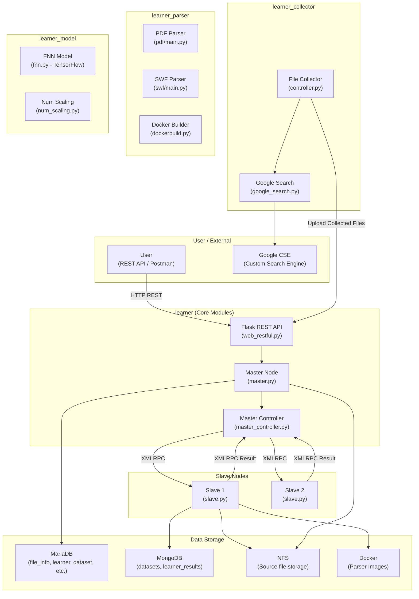
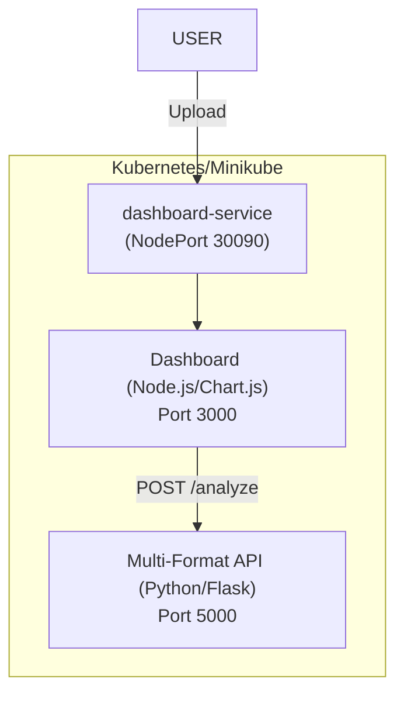

# Triangle AI

## 📌 Overview

**Triangle AI** is a **distributed machine learning framework for file-based malware detection**.

It analyzes various file formats including **PDF, MS Office, JavaScript, HTML, LNK, and SWF** to extract structural features and classifies files as **benign** or **malicious** using both static analysis and machine learning (TensorFlow).

### 📁 Supported Formats & Detection Scope

| File Type | Extensions | Key Analysis Features |
|:---|:---|:---|
| **PDF** | `.pdf` | JS engine, embedded PE, stream de-obfuscation, structure integrity analysis |
| **MS Office** | `.docx, .docm, .xlsx, .xlsm` | VBA macro threat detection (MacroRaptor), external links, and obfuscation analysis |
| **Scripts** | `.js, .vbs, .ps1` | `eval`, `unescape`, `PowerShell/CMD` execution patterns, and de-obfuscation |
| **Web** | `.html, .htm` | Malicious script tags, ActiveX objects, phishing/XSS pattern analysis |
| **Windows Link** | `.lnk` | Payload download and execution detection via PowerShell/CMD |
| **Flash** | `.swf` | ActionScript API call pattern analysis and YARA-based threat detection |

> [!IMPORTANT]
> The system is designed with a **Master-Slave Cluster** architecture, not a single server. It leverages XMLRPC-based distributed processing to parse and train large volumes of files in parallel.

---

## 🏗️ System Architecture



---

## 📦 Core Modules

### 1. `learner` — Framework Backbone
The central module managing orchestration and distributed task allocation.

| File | Role |
|------|------|
| `starter.py` | Entry point. Launches Master/Slave via multiprocessing. |
| `cluster/master.py` | **Master Interface** — Dataset management, algorithm control, training & prediction. |
| `cluster/master_controller.py` | **Cluster Controller** — Task splitting, Slave allocation, XMLRPC management. |
| `cluster/slave.py` | **Slave Node** — Executes file parsing inside Docker and TF training/prediction. |
| `ui/web_restful.py` | Flask-RESTful based **HTTP API** (Port 8000). |
| `db/rdb_schemas.py` | 12-table RDB schema definitions. |

### 2. `learner_collector` — File Crawler
Uses **Google Custom Search Engine API** to automatically collect files (primarily PDF) from the internet.

### 3. `learner_model` — ML Intelligence
Implements a **Feedforward Neural Network (FNN)** based on **TensorFlow**. Supports dynamic algorithm loading and batch training.

### 4. `learner_parser` — Feature Extractor
Deeply inspects file formats to extract features for machine learning.
- **PDF Parser**: Regex-based parsing, stream decoding, JS extraction.
- **SWF Parser**: Tag analysis, ActionScript extraction, YARA scan.

---

## 🔌 REST API Endpoints

The system operates a Flask-RESTful server on port **8000**.

| Endpoint | Method | Description |
|------|--------|------|
| `/files` | POST | Upload files (Save to NFS + metadata to RDB) |
| `/dataset/info` | PATCH | **Start Dataset Parsing** (Distributed task) |
| `/classification/learners/<name>` | PATCH | **Start Training** |
| `/classification/learners/<name>/predict` | POST | **Predict File Risk** (Benign/Malicious) |

---

## 🐳 Kubernetes Deployment Guide

Triangle AI provides a scalable analysis engine and a visualization dashboard on Kubernetes.

### Architecture



### Installation

```bash
cd k8s-deploy
bash deploy.sh
```

---

## 🛠️ Tech Stack
- **Language**: Python 3.11
- **ML**: TensorFlow (FNN)
- **Web**: Flask, Express, Node.js
- **Database**: MariaDB, MongoDB
- **Storage**: NFS (Network File System)
- **Containerization**: Docker, Kubernetes (Minikube)
- **Communication**: XMLRPC

---

## ⚖️ License
Licensed under the **Apache License 2.0**. See the [LICENSE](LICENSE) file for details.
