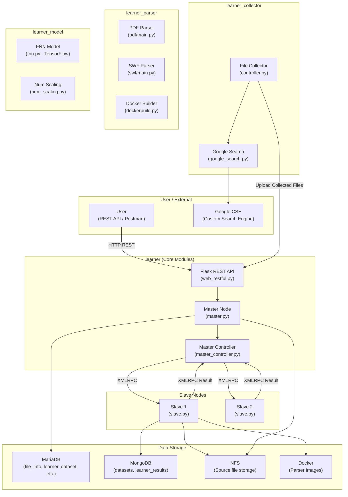
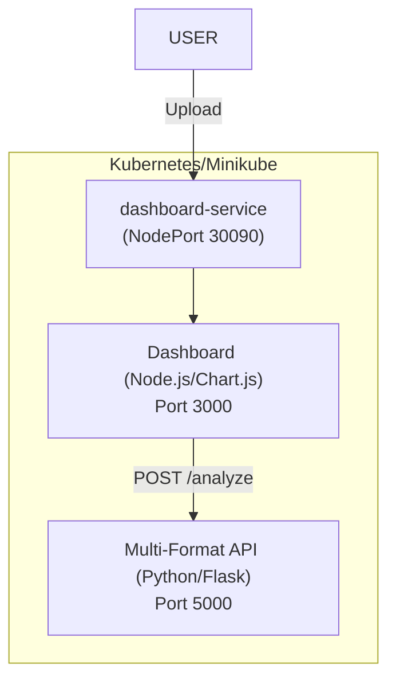
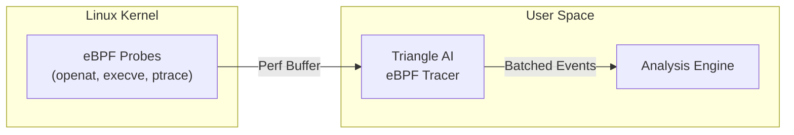
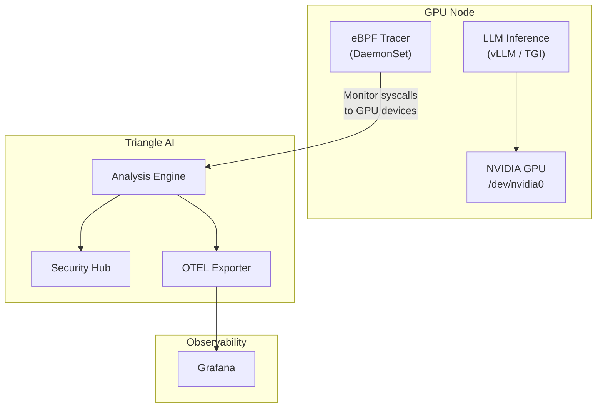

# Triangle AI

## 📌 Overview

**Triangle AI** is a **distributed machine learning framework for file-based malware detection**.

It analyzes various file formats including **PDF, MS Office, JavaScript, HTML, LNK, and SWF** to extract structural features and classifies files as **benign** or **malicious** using both static analysis and machine learning (TensorFlow).

### 📁 Supported Formats & Detection Scope

| File Type | Extensions | Key Analysis Features |
|:---|:---|:---|
| **PDF** | `.pdf` | JS engine, embedded PE, stream de-obfuscation, structure integrity analysis |
| **MS Office** | `.docx, .docm, .xlsx, .xlsm` | VBA macro threat detection (MacroRaptor), external links, and obfuscation analysis |
| **Scripts** | `.js, .vbs, .ps1` | `eval`, `unescape`, `PowerShell/CMD` execution patterns, and de-obfuscation |
| **Web** | `.html, .htm` | Malicious script tags, ActiveX objects, phishing/XSS pattern analysis |
| **Windows Link** | `.lnk` | Payload download and execution detection via PowerShell/CMD |
| **Flash** | `.swf` | ActionScript API call pattern analysis and YARA-based threat detection |

> [!IMPORTANT]
> The system is designed with a **Master-Slave Cluster** architecture, not a single server. It leverages XMLRPC-based distributed processing to parse and train large volumes of files in parallel.

---

## 🏗️ System Architecture



---

## 📦 Core Modules

### 1. `learner` — Framework Backbone
The central module managing orchestration and distributed task allocation.

| File | Role |
|------|------|
| `starter.py` | Entry point. Launches Master/Slave via multiprocessing. |
| `cluster/master.py` | **Master Interface** — Dataset management, algorithm control, training & prediction. |
| `cluster/master_controller.py` | **Cluster Controller** — Task splitting, Slave allocation, XMLRPC management. |
| `cluster/slave.py` | **Slave Node** — Executes file parsing inside Docker and TF training/prediction. |
| `ui/web_restful.py` | Flask-RESTful based **HTTP API** (Port 8000). |
| `db/rdb_schemas.py` | 12-table RDB schema definitions. |

### 2. `learner_collector` — File Crawler
Uses **Google Custom Search Engine API** to automatically collect files (primarily PDF) from the internet.

### 3. `learner_model` — ML Intelligence
Implements a **Feedforward Neural Network (FNN)** based on **TensorFlow**. Supports dynamic algorithm loading and batch training.

### 4. `learner_parser` — Feature Extractor
Deeply inspects file formats to extract features for machine learning.
- **PDF Parser**: Regex-based parsing, stream decoding, JS extraction.
- **SWF Parser**: Tag analysis, ActionScript extraction, YARA scan.

---

## 🔌 REST API Endpoints

The system operates a Flask-RESTful server on port **8000**.

| Endpoint | Method | Description |
|------|--------|------|
| `/files` | POST | Upload files (Save to NFS + metadata to RDB) |
| `/dataset/info` | PATCH | **Start Dataset Parsing** (Distributed task) |
| `/classification/learners/<name>` | PATCH | **Start Training** |
| `/classification/learners/<name>/predict` | POST | **Predict File Risk** (Benign/Malicious) |

---

## 🐳 Kubernetes Deployment Guide

Triangle AI provides a scalable analysis engine and a visualization dashboard on Kubernetes.

#### Main Dashboard (File Upload)


#### Detailed Analysis Results


### Architecture



### Installation

```bash
cd k8s-deploy
bash deploy.sh
```

---

## 🤖 AI-Powered Analysis (Ollama Integration)

Triangle AI v0.1 supports enhanced threat reporting using **Local LLMs via Ollama**. This feature provides human-readable technical insights and mitigation strategies based on static analysis findings.

### 📋 Prerequisites
1.  **Ollama** installed on your host machine ([ollama.com](https://ollama.com)).
2.  One or more of the following models pulled:
    - `gemma4:e2b` (Recommended for high-performance security analysis)
    - `mistral:7b`
    - `qwen2.5:7b` (Recommended for script/code analysis)

### ⚙️ Configuration
The analyzer pod communicates with Ollama via the `host.minikube.internal` address (default for Minikube).

To change the model or URL, update the environment variables in `k8s/pdf-analyzer.yaml`:
```yaml
env:
  - name: OLLAMA_URL
    value: "http://host.minikube.internal:11434"
  - name: OLLAMA_MODEL
    value: "gemma4:e2b"
```

### 🧠 Features
- **Threat Assessment**: High-level summary of the file's potential intent.
- **Technical Impact**: Analysis of what the detected indicators (macros, JS APIs) can do to a system.
- **Actionable Mitigation**: Professional advice on how to handle the specific threat.

---

## 🚀 Cloud Native Security Hub

Triangle AI now includes a complete **Cloud Native Security Hub** designed for real-time monitoring of Kubernetes clusters. It uses a DaemonSet-based scanner to watch all host filesystem changes and resolves security events to specific K8s Namespaces and Pods using the Kubernetes API.


### Key Features
- **Real-time Node Protection**: DaemonSet scanner watches all files entering the cluster (e.g., via volume mounts or hostPath).
- **K8s Context Aware**: Automatically resolves file events to the responsible **Namespace** and **Pod**.
- **SOC Intelligence**: Grafana-inspired dashboard with live threat feeds, risk score timelines, and verdict distribution.
- **Persistent Forensics**: Browser-side persistent history with search and sortable analysis results.
- **AI Insights**: Automated security summaries for each detected threat via Ollama.

### Setup & Usage
1. **Deploy all components**:
   ```bash
   kubectl apply -f k8s-deploy/k8s/
   ```
2. **Access the Security Hub**:
   ```bash
   kubectl port-forward service/security-hub-service -n npe-learner 30091:3001
   ```
   Open `http://localhost:30091` in your browser.

---

## ⚡ eBPF-Based Kernel Security Tracing

Triangle AI v0.2 introduces a **high-performance eBPF (extended Berkeley Packet Filter)** tracer that attaches directly to the Linux kernel to monitor syscalls in real-time — without modifying application code or adding sidecar proxies.

### How It Works



### Traced Syscalls
| Syscall | Detection Target |
|---------|-----------------|
| `openat` | Sensitive file access (secrets, shadow, GPU devices) |
| `execve` | Suspicious process execution (shells, curl, wget) |
| `ptrace` | Process injection, GPU memory exfiltration attempts |

### Deployment
```bash
kubectl apply -f k8s-deploy/k8s/ebpf-tracer-daemonset.yaml
```

> [!NOTE]
> The eBPF tracer requires `privileged: true` and kernel headers. It runs as a DaemonSet to cover every node in the cluster.

---

## 🛡️ Admission Controller (Security Policy Webhook)

Triangle AI includes a **Kubernetes ValidatingWebhookConfiguration** that blocks non-compliant containers **before** they are created. This shifts security enforcement left — from detection to prevention.

### Enforced Policies

| Policy | Description | Default |
|--------|-------------|---------|
| **Privileged Mode** | Blocks containers requesting `privileged: true` | ✅ Enabled |
| **Root User** | Blocks containers running as UID 0 | ✅ Enabled |
| **Resource Limits** | Requires CPU and memory limits on every container | ✅ Enabled |
| **Host Path** | Blocks `hostPath` volume mounts | ✅ Enabled |
| **Host Namespace** | Blocks `hostPID` and `hostNetwork` access | ✅ Enabled |
| **Image Registry** | Restricts images to approved registries only | ✅ Enabled |
| **Dangerous Capabilities** | Blocks `SYS_ADMIN`, `NET_RAW`, `SYS_PTRACE`, `ALL` | ✅ Enabled |
| **GPU Annotation** | Requires `triangle-ai/gpu-approved: true` for GPU access | ✅ Enabled |

### Deployment
```bash
# 1. Generate TLS certificates
openssl req -x509 -newkey rsa:2048 -keyout tls.key -out tls.crt \
  -days 365 -nodes -subj "/CN=triangle-admission-controller.npe-learner.svc"

# 2. Create K8s TLS secret
kubectl create secret tls triangle-admission-tls \
  --cert=tls.crt --key=tls.key -n npe-learner

# 3. Deploy webhook
kubectl apply -f k8s-deploy/k8s/admission-controller.yaml
```

> [!IMPORTANT]
> Denied pod creation attempts are automatically recorded in the Triangle AI audit log, accessible via the `/api/admission-events` endpoint.

---

## 📡 OpenTelemetry Integration (OTLP Export)

All Triangle AI security events can be exported in **OpenTelemetry Protocol (OTLP)** format for seamless integration with observability platforms.

### Supported Backends
- **Grafana** (via Tempo for traces, Mimir for metrics, Loki for logs)
- **Jaeger** (distributed tracing)
- **Datadog**, **New Relic**, **Splunk** (via OTLP endpoint)

### Exported Signals

| Signal | Content | Format |
|--------|---------|--------|
| **Traces** | Each security scan as a span with file/K8s attributes | OTLP gRPC/HTTP |
| **Metrics** | `triangle.security.scans.total`, `triangle.security.threats.total`, `triangle.security.risk_score` | OTLP gRPC/HTTP |
| **Logs** | Structured security event logs with severity mapping | OTLP gRPC/HTTP |

### Deployment
```bash
kubectl apply -f k8s-deploy/k8s/otel-exporter.yaml
```

### Environment Variables
| Variable | Default | Description |
|----------|---------|-------------|
| `OTEL_EXPORTER_OTLP_ENDPOINT` | `http://otel-collector:4317` | OTLP collector endpoint |
| `OTEL_EXPORTER_OTLP_PROTOCOL` | `grpc` | Protocol (`grpc` or `http/protobuf`) |
| `OTEL_SERVICE_NAME` | `triangle-ai-security` | Service name in traces |

---

## 🎮 GPU Security Monitoring

Triangle AI v0.2 extends security monitoring to **GPU-accelerated LLM inference workloads**, detecting unauthorized GPU memory access and model weight theft attempts.

### Threat Detection Scope

| Threat | Detection Method | Severity |
|--------|-----------------|----------|
| **GPU Device Direct Access** | eBPF tracing of `/dev/nvidia*` and `/proc/driver/nvidia` opens | 🔴 High |
| **Model Weight Exfiltration** | File access monitoring for `.safetensors`, `.pt`, `.gguf`, `.onnx`, `.bin` | 🔴 High |
| **GPU Memory Attach** | `ptrace(PTRACE_ATTACH)` on GPU-using processes | 🔴 Critical |
| **GPU Memory Peek** | `ptrace(PTRACE_PEEKDATA)` reading GPU process memory | 🔴 Critical |
| **Unapproved GPU Allocation** | Admission Controller blocks pods requesting `nvidia.com/gpu` without annotation | 🟡 Medium |

### Architecture



### How to Enable
Set the `GPU_MONITOR_ENABLED` environment variable to `true` in the eBPF tracer DaemonSet:
```yaml
env:
  - name: GPU_MONITOR_ENABLED
    value: "true"
```

> [!WARNING]
> GPU monitoring requires the eBPF tracer to run on GPU nodes. Ensure the DaemonSet tolerates GPU node taints.

---

## 🛠️ Tech Stack
- **Language**: Python 3.11
- **ML**: TensorFlow (FNN)
- **Web**: Flask, Express, Node.js
- **Database**: MariaDB, MongoDB
- **Storage**: NFS (Network File System)
- **Containerization**: Docker, Kubernetes (Minikube)
- **Communication**: XMLRPC
- **Kernel Tracing**: eBPF / BCC
- **Observability**: OpenTelemetry (OTLP)
- **Policy Enforcement**: Kubernetes Admission Webhooks

---

## ⚖️ License
Licensed under the **Apache License 2.0**. See the [LICENSE](LICENSE) file for details.
