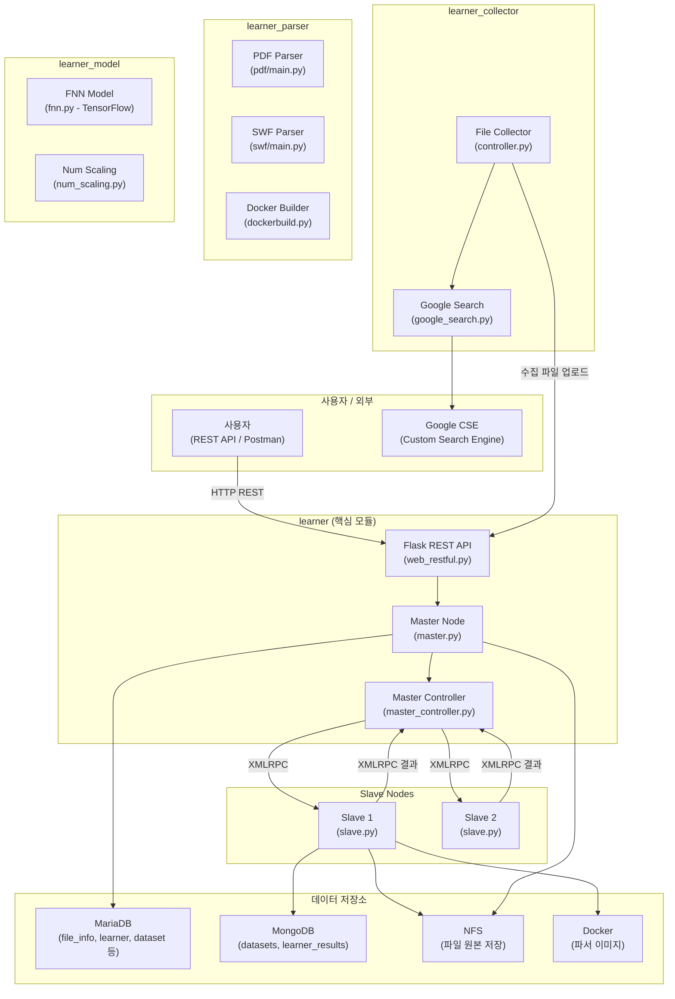
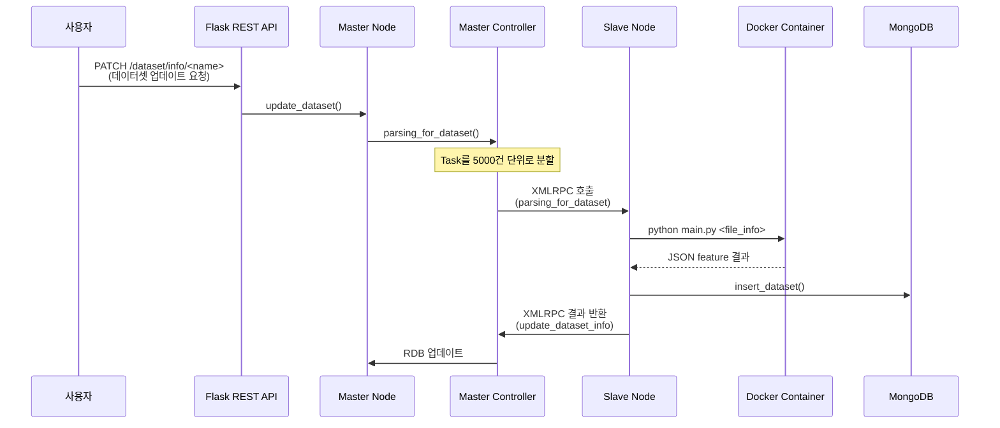
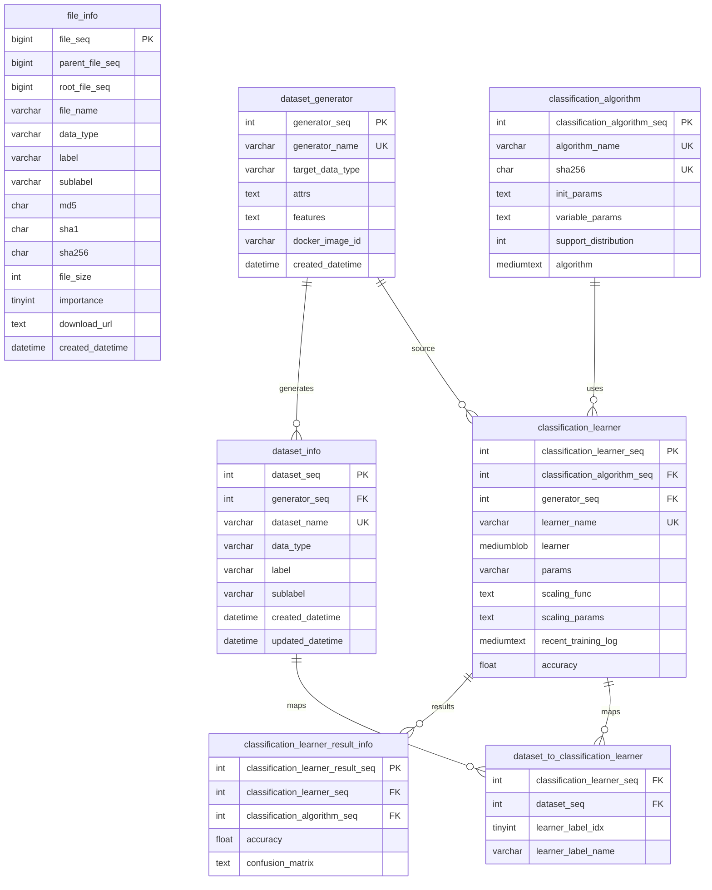
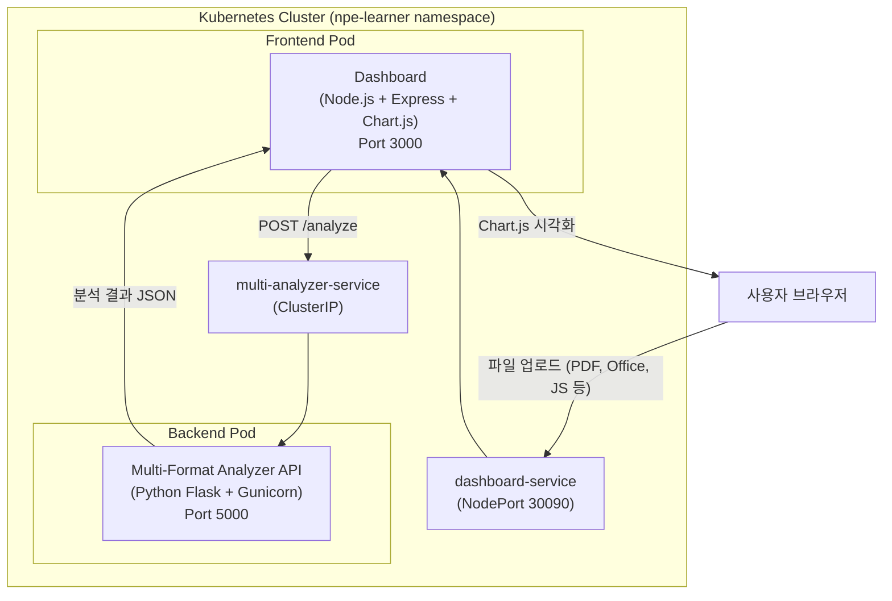
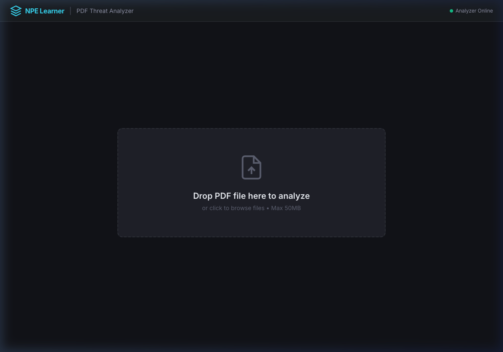
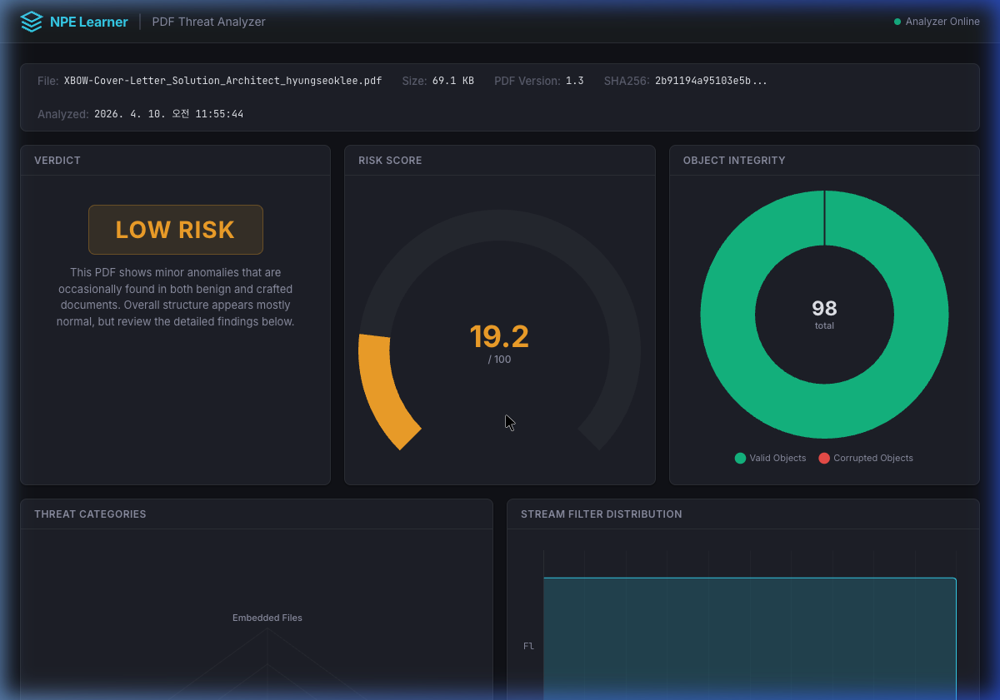
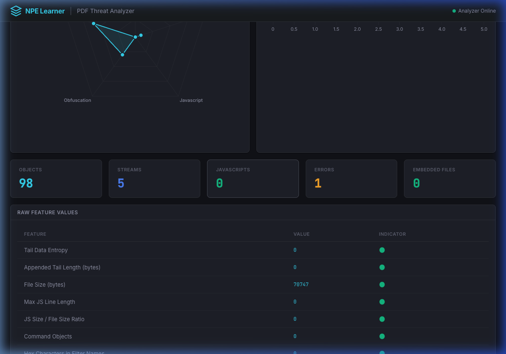
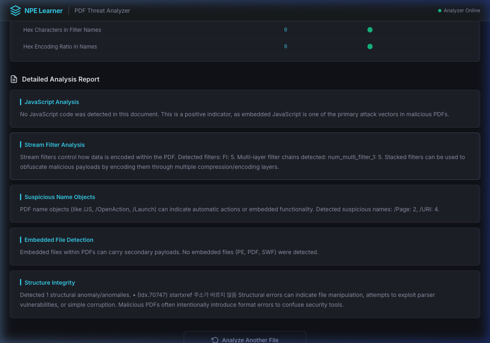

# Triangle

## 📌 개요

**Triangle**은 **파일 기반 악성코드 탐지를 위한 분산 머신러닝 프레임워크**입니다.

주로 **PDF, MS Office, JavaScript, HTML, LNK, SWF** 등의 다양한 파일 포맷을 분석하여 구조적 특징(feature)을 추출하고, 이를 기반으로 **정적 분석 및 머신러닝**을 사용하여 **양성(benign) / 악성(malicious)** 파일을 분류합니다.

### 📁 분석 지원 파일 및 탐지 범위

| 파일 타입 | 확장자 | 탐지/분석 주요 내용 |
|:---|:---|:---|
| **PDF** | `.pdf` | JavaScript 엔진, 임베디드 PE, 스트림 난독화, 구조적 손상 분석 |
| **MS Office** | `.docx, .docm, .xlsx, .xlsm` | VBA 매크로 위협 탐지 (MacroRaptor), 외부 연결 및 난독화 분석 |
| **Scripts** | `.js, .vbs, .ps1` | `eval`, `unescape`, `PowerShell/CMD` 실행 패턴 및 난독화 탐지 |
| **Web** | `.html, .htm` | 유해 스크립트 태그, ActiveX 객체, 피싱/XSS 패턴 분석 |
| **Windows Link** | `.lnk` | 파워쉘/명령프롬프트를 이용한 2차 페이로드 다운로드 및 실행 탐지 |
| **Flash** | `.swf` | ActionScript API 호출 패턴 및 YARA 규칙 기반 위협 분석 |

> [!IMPORTANT]
> 이 시스템은 단일 서버가 아닌 **Master-Slave 클러스터** 아키텍처로 설계되어 있습니다. XMLRPC 기반의 분산 처리를 통해 대량의 파일을 병렬로 파싱하고 학습합니다.

---

## 🏗️ 시스템 아키텍처



---

## 📦 4개 핵심 모듈 상세 분석

### 1. `learner` — 핵심 프레임워크 (Master/Slave 클러스터)

전체 시스템의 **중추 역할**을 하는 모듈입니다.

| 파일 | 역할 |
|------|------|
| `starter.py` | 클러스터 엔트리포인트. Master/Slave를 multiprocessing으로 기동 |
| `cluster/master.py` | **Master 노드 인터페이스** — 파일 업로드, 데이터셋 관리, 알고리즘 관리, 학습 명령, 예측 |
| `cluster/master_controller.py` | **클러스터 제어** — Task 생성, Slave 연결/할당, XMLRPC 서버/클라이언트 |
| `cluster/slave.py` | **Slave 노드** — Docker 컨테이너 내에서 파일 파싱, TF 학습/예측 수행 |
| `ui/web_restful.py` | Flask-RESTful 기반 **HTTP API** (포트 8000) |
| `db/rdb.py` | MariaDB 클라이언트 (파티셔닝, 트랜잭션 최적화) |
| `db/nosql.py` | MongoDB 클라이언트 (데이터셋 저장/조회) |
| `db/nfs.py` | NFS 파일 시스템 클라이언트 (SHA256 기반 경로 분산) |
| `db/rdb_schemas.py` | 12개 테이블 스키마 정의 |
| `util/essential.py` | 유틸리티 (해시 계산, 설정 파일 로딩, DB 커서→딕셔너리 변환) |

#### Master-Slave 통신 구조



---

### 2. `learner_collector` — 파일 수집기

**Google Custom Search Engine API**를 사용하여 인터넷에서 파일(주로 PDF)을 자동 수집합니다.

| 파일 | 역할 |
|------|------|
| `collector/controller.py` | 수집 프로세스 관리 — 주기적 스케줄링, 자식 프로세스 모니터링 |
| `collector/google_search.py` | Google CSE API 래퍼 — 키워드 검색, MIME 필터링, 자동 페이징 |

**동작 흐름:**
1. Google CSE로 특정 파일 타입(pdf 등) 검색
2. MIME type 검증 후 파일 다운로드
3. MD5/SHA1/SHA256 해시 계산
4. NFS에 파일 저장 + Master REST API로 메타정보 전송

---

### 3. `learner_model` — ML 모델

**TensorFlow 기반 Feedforward Neural Network (FNN)** 구현체입니다.

| 파일 | 역할 |
|------|------|
| `model/fnn.py` | **다층 FNN** — 가변 Hidden Layer, Adagrad 옵티마이저, Softmax 출력 |
| `scaling/num_scaling.py` | Feature 정규화 — log(1+x) 스케일링 |

**FNN 모델 특징:**
- 입력: 파일 feature 벡터 → 가변 Hidden Layer(기본 3×100) → Softmax 출력(benign/malicious)
- `partial_fit()`: 온라인 배치 학습
- `export_learner()` / `load_learner()`: tar.gz 형태로 모델 직렬화/역직렬화
- 알고리즘 스크립트를 **DB에 저장**하여 런타임에 `compile()` + `exec()`으로 동적 로딩

---

### 4. `learner_parser` — 파일 파서 (Feature Extractor)

파일 포맷을 심층 분석하여 **머신러닝 학습용 feature를 추출**합니다.

| 파일 | 역할 |
|------|------|
| `parser/pdf/main.py` | **PDF 파서** — 정규식 기반 파싱, 스트림 디코딩, JS 추출, 임베디드 파일 탐지 |
| `parser/pdf/lzw.py` | LZW 디코더 |
| `parser/pdf/ccitt.py` | CCITT Fax 디코더 |
| `parser/swf/main.py` | **SWF(Flash) 파서** — 태그 분석, ActionScript 추출, YARA 규칙 기반 API 탐지 |
| `parser/dockerbuild.py` | 파서를 Docker 이미지로 빌드 |

#### PDF에서 추출하는 주요 Feature들

| Feature 카테고리 | 설명 |
|:---|:---|
| `num_suspicious_name` | 의심 PDF 이름 수 (JS, JavaScript, AA, OpenAction, Launch 등) |
| `num_filter` / `ratio_filter` | 스트림 필터 종류별 수/비율 (FlateDecode, ASCIIHexDecode 등) |
| `num_multi_filter` | 다중 필터 체인 수 (난독화 지표) |
| `js_max_line_length` | 삽입된 JavaScript 최대 줄 길이 (난독화 탐지) |
| `js_ratio_in_size` | JS 코드 크기 / 전체 파일 크기 비율 |
| `js_num_api` | YARA 규칙으로 탐지한 JavaScript API 호출 수 |
| `format_error` | PDF 구조 오류 수 (악성 PDF는 구조가 손상된 경우 많음) |
| `appended_tail_entropy` | 파일 끝에 추가된 데이터의 Shannon 엔트로피 |
| `num_file` | 임베디드 파일 수 (PE, PDF, SWF) |
| `ratio_hex_in_name` | 이름 내 hex 인코딩 비율 (난독화 지표) |

#### SWF에서 추출하는 주요 Feature들

| Feature 카테고리 | 설명 |
|:---|:---|
| `num_tag` | SWF 태그 종류별 수 (DoAction, DefineShape, PlaceObject 등 89종) |
| `num_api` | YARA 규칙으로 탐지한 ActionScript API 호출 수 |
| `orig_file_size` | 원본 파일 크기 |
| `decom_file_size` | 압축 해제 후 파일 크기 (CWS: zlib, ZWS: LZMA) |

---

## 🔌 REST API 엔드포인트

포트 **8000**에서 Flask-RESTful 서버가 동작합니다.

### 1. Files (파일 관리)

| 경로 | Method | 기능 |
|------|--------|------|
| `/files` | POST | 파일 업로드 (NFS 저장 + RDB 메타정보) |
| `/files` | GET | 파일 정보 조회 (data_type, label 필터링) |
| `/files/<sha256>` | GET | 특정 파일 정보 조회 |
| `/files/<sha256>/download` | GET | 파일 다운로드 |

### 2. Dataset Generators (데이터셋 생성기)

| 경로 | Method | 기능 |
|------|--------|------|
| `/dataset/generators` | POST | Docker 파서 이미지 업로드 |
| `/dataset/generators` | GET | 생성기 목록 조회 |
| `/dataset/generators/<name>` | GET | 특정 생성기 조회 |
| `/dataset/generators/<name>/download` | GET | Docker 이미지 다운로드 |

### 3. Dataset Info (데이터셋 정보)

| 경로 | Method | 기능 |
|------|--------|------|
| `/dataset/info` | POST | 데이터셋 생성 |
| `/dataset/info` | GET | 데이터셋 목록 조회 |
| `/dataset/info` | PATCH | **모든 데이터셋 파싱 시작** (분산 처리) |
| `/dataset/info/<name>` | PATCH | **특정 데이터셋 파싱 시작** |

### 4. Classification (분류 학습/예측)

| 경로 | Method | 기능 |
|------|--------|------|
| `/classification/algorithms` | POST | TF 알고리즘 스크립트 업로드 |
| `/classification/algorithms` | GET | 알고리즘 목록 조회 |
| `/classification/algorithms/<name>/download` | GET | 알고리즘 스크립트 다운로드 |
| `/classification/learners` | POST | Learner(학습기) 생성 |
| `/classification/learners` | GET | Learner 목록 조회 |
| `/classification/learners/<name>` | PATCH | **학습 시작** (num_iter, batch_size 등) |
| `/classification/learners/<name>/predict` | POST | **파일 예측** (benign/malicious) |
| `/classification/learners/<name>/log` | GET | 최근 학습 로그 조회 (JSON) |
| `/classification/learners/<name>/log.html` | GET | 최근 학습 로그 조회 (HTML) |

### 5. 기타

| 경로 | Method | 기능 |
|------|--------|------|
| `/pdf_analyzer` | POST | PDF 단독 분석 (파서 직접 호출) |

---

## 💾 데이터베이스 스키마

### MariaDB (RDB) — 12개 테이블



### MongoDB (NoSQL)

| 컬렉션 | 용도 |
|:---|:---|
| `datasets.<dataset_name>` | 파싱 결과 feature 데이터 저장 (file_seq를 _id로 사용) |
| `datasets.unique_column_names` | 각 데이터셋의 고유 컬럼 이름 관리 |
| `learner_results.<learner_name>_<datetime>` | 예측 결과 저장 |

### NFS (파일 스토리지)

| 경로 | 용도 |
|:---|:---|
| `/files/<sha256[0:3]>/<sha256[3:6]>/.../<sha256>` | 원본 파일 (SHA256 해시 트리) |
| `/files/tmp/` | 임시 파일 (예측 시 사용, 자동 삭제) |
| `/docker_images/<image_id>.tar` | Docker 파서 이미지 |

---

## 🔄 전체 데이터 파이프라인


| 단계 | API | 설명 |
|:---|:---|:---|
| 1 | Collector / `POST /files` | 인터넷에서 파일 수집 or 직접 업로드 |
| 2 | 내부 처리 | SHA256 기반 NFS 저장 + MariaDB 파티셔닝 |
| 3 | `POST /dataset/generators` | PDF/SWF 파서를 Docker 이미지로 등록 |
| 4 | `PATCH /dataset/info/<name>` | Slave가 Docker 컨테이너에서 파싱 → MongoDB 저장 |
| 5 | `POST /classification/algorithms` | FNN 같은 TF 스크립트를 DB에 등록 |
| 6 | `POST /classification/learners` | 대상 데이터셋 + 알고리즘 조합으로 Learner 생성 |
| 7 | `PATCH /classification/learners/<name>` | Master가 Task 분할 → Slave에서 학습 실행 |
| 8 | `POST /classification/learners/<name>/predict` | 새 파일 업로드 → 파싱 → 예측 결과 반환 |

---

## 🛠️ 기술 스택 요약

| 분류 | 기술 |
|:---|:---|
| 언어 | Python 3 |
| ML 프레임워크 | TensorFlow (FNN) |
| 웹 프레임워크 | Flask + Flask-RESTful |
| RDB | MariaDB (파티셔닝, pymysql) |
| NoSQL | MongoDB (pymongo) |
| 파일 스토리지 | NFS (libnfs) |
| 컨테이너 | Docker (파서 실행 환경) |
| 분산 통신 | XMLRPC (Master ↔ Slave) |
| 파일 분석 | YARA Rules, 정규식 기반 파싱 |
| 수집 | Google Custom Search Engine API |
| 문서 | Sphinx (자동 API 문서 생성) |

---

## 🎯 핵심 설계 특징

### 1. 알고리즘의 동적 로딩
ML 알고리즘을 Python 스크립트 텍스트로 DB에 저장하고, 런타임에 `compile()` + `exec()`으로 모듈화하여 로드합니다. 새로운 알고리즘을 서버 재시작 없이 추가할 수 있습니다.

```python
# slave.py에서의 동적 모듈 로딩
def __load_module(self, name, pyscript):
    code_object = compile(pyscript, '<string>', 'exec')
    module = types.ModuleType(name)
    exec(code_object, module.__dict__)
    return module
```

### 2. Docker 기반 파서 격리
파일 파서(PDF, SWF)를 Docker 이미지로 패키징하여 Slave에서 실행합니다. 악성 파일 분석 시 호스트 시스템을 보호하며, NFS 볼륨을 읽기 전용(ro)으로 마운트합니다.

### 3. MariaDB 파티셔닝
`file_info` 테이블은 `data_type_label_sublabel` 컬럼으로 **LIST 파티셔닝** 되어, 특정 타입의 파일만 빠르게 조회할 수 있습니다. 새로운 파일 타입이 들어올 때 파티션이 **자동 생성**됩니다.

```sql
-- 예: pdf_benign_cse_ 파티션
ALTER TABLE file_info ADD PARTITION
  (PARTITION pdf_benign_cse_ VALUES IN ('pdf_benign_cse_'))
```

### 4. 트랜잭션 최적화
RDB의 `_QueryManager`는 빈번한 `commit()` 호출을 방지하기 위해 **2초 타이머 기반 지연 커밋**을 구현합니다. 100건 이상 또는 누적 5초 초과 시 즉시 커밋합니다.

### 5. SHA256 기반 해시 트리 스토리지
NFS에 파일을 저장할 때 SHA256의 앞 12자를 3자씩 나누어 디렉토리 계층을 만듭니다. 이는 디렉토리당 파일 수를 제한하여 파일 시스템 성능을 유지합니다.

```
/files/abc/def/ghi/jkl/abcdefghijkl...full_sha256
```

### 6. Task 분할과 GPU 인지 스케줄링
Master는 대용량 작업을 **5,000건 단위**로 분할하고, GPU가 필요한 학습 Task는 GPU가 있는 Slave에 우선 할당합니다. Docker 이미지가 이미 로드된 Slave에도 우선 할당하여 이미지 전송 오버헤드를 줄입니다.

### 7. 데이터셋 비율 분할 (정규식 기반)
학습/검증/테스트 데이터를 SHA256 해시의 첫 글자에 대한 **정규식 매칭**으로 분할합니다. 이는 결정론적이면서도 균등한 분할을 보장합니다.

```json
{
  "train": "^[0-9a-d]",   // ~87.5% (14/16)
  "valid": "^e",           // ~6.25% (1/16)
  "test":  "^f"            // ~6.25% (1/16)
}
```

---

## 📁 프로젝트 디렉토리 구조

```
src/
├── learner/                          # 핵심 프레임워크
│   ├── Learner.postman_collection.json   # API 테스트 컬렉션
│   ├── learner.sql                       # MariaDB 스키마 (12개 테이블)
│   ├── how_to_build_doc                  # Sphinx 문서 빌드 방법
│   ├── etc/                              # 인프라 설정 (NFS, NoSQL, RDB 서버)
│   └── src/
│       ├── starter.py                    # 엔트리포인트
│       ├── rdb.conf                      # MariaDB 접속 정보
│       └── learner/
│           ├── cluster/
│           │   ├── master.py             # Master 인터페이스 (723줄)
│           │   ├── master_controller.py  # 클러스터 제어 (352줄)
│           │   └── slave.py              # Slave 로직 (528줄)
│           ├── db/
│           │   ├── rdb.py                # MariaDB 클라이언트
│           │   ├── nosql.py              # MongoDB 클라이언트
│           │   ├── nfs.py                # NFS 클라이언트
│           │   └── rdb_schemas.py        # 테이블 스키마 정의
│           ├── ui/
│           │   └── web_restful.py        # Flask REST API (759줄)
│           └── util/
│               └── essential.py          # 공통 유틸리티
│
├── learner_collector/                # 파일 수집 모듈
│   └── src/learner/collector/
│       ├── controller.py                 # 수집 프로세스 관리
│       └── google_search.py              # Google CSE 래퍼
│
├── learner_model/                    # ML 모델 모듈
│   └── src/learner/
│       ├── model/
│       │   ├── fnn.py                    # TensorFlow FNN (242줄)
│       │   └── tester.py                 # 모델 테스터
│       └── scaling/
│           └── num_scaling.py            # Feature 스케일링
│
└── learner_parser/                   # 파일 파서 모듈
    └── src/learner/parser/
        ├── dockerbuild.py                # Docker 이미지 빌드
        ├── pdf/
        │   ├── main.py                   # PDF 파서 (1073줄)
        │   ├── lzw.py                    # LZW 디코더
        │   └── ccitt.py                  # CCITT Fax 디코더
        └── swf/
            └── main.py                   # SWF 파서 (261줄)
```

---

## 📊 코드 규모

| 모듈 | 주요 파일 수 | 총 라인 수 (추정) |
|:---|:---:|:---:|
| `learner` (core) | 10 | ~3,000줄 |
| `learner_collector` | 2 | ~300줄 |
| `learner_model` | 2 | ~270줄 |
| `learner_parser` | 5 | ~1,600줄 |
| SQL 스키마 | 1 | ~430줄 |
| **합계** | **20** | **~5,600줄** |

---

## 🐳 Kubernetes 컨테이너 배포 가이드

NPE Learner의 PDF 분석 엔진을 Kubernetes에 컨테이너로 배포하고, 웹 대시보드에서 분석 결과를 시각화하는 서비스입니다.

> [!NOTE]
> 이 배포 패키지는 `k8s-deploy/` 디렉토리에 위치하며, **PDF, MS Office, JavaScript, HTML, LNK** 등 다양한 파일 포맷에 대한 정적 분석 및 위협 탐지를 지원하는 멀티 포맷 분석 엔진으로 고도화되었습니다.

### 배포 아키텍처



### 배포 디렉토리 구조

```
k8s-deploy/
├── deploy.sh                    # 원클릭 배포 스크립트
├── pdf-analyzer/                # Backend: PDF 분석 API
│   ├── Dockerfile
│   ├── requirements.txt         # flask, flask-cors, gunicorn
│   ├── app.py                   # Flask REST API + 위험도 점수 + 보고서 생성
│   └── parser/                  # NPE Learner PDF 파서 (독립 실행 가능하게 수정)
│       ├── __init__.py
│       ├── main.py              # PDF 파서 (yara/entropy fallback 포함)
│       ├── lzw.py
│       ├── ccitt.py
│       └── pdf_js_apis.yar      # JavaScript API 탐지 YARA 규칙
├── dashboard/                   # Frontend: Grafana 스타일 대시보드
│   ├── Dockerfile
│   ├── package.json
│   ├── server.js                # Express 프록시 서버
│   └── public/
│       ├── index.html           # 대시보드 UI
│       ├── style.css            # 다크 테마 CSS
│       └── app.js               # Chart.js 차트 (Gauge, Pie, Radar, Bar)
└── k8s/                         # Kubernetes 매니페스트
    ├── namespace.yaml
    ├── pdf-analyzer.yaml        # Deployment + ClusterIP Service
    └── dashboard.yaml           # Deployment + NodePort Service
```

### 사전 요구사항

| 도구 | 용도 |
|:---|:---|
| Docker Desktop | 컨테이너 이미지 빌드 |
| Minikube | 로컬 Kubernetes 클러스터 |
| kubectl | Kubernetes 리소스 관리 |

### 1단계: 원클릭 배포

```bash
cd NPELearner/k8s-deploy
bash deploy.sh
```

스크립트 실행 시 선택할 수 있는 배포 모드:
1.  **Local Mode (Minikube/Kind)**: 이미지를 빌드한 후 자동으로 로컬 클러스터에 로드합니다 (별도의 가입/로그인 불필요).
2.  **Remote Mode (GKE/EKS/Azure 등)**: 이미지를 빌드한 후 본인의 Docker Hub 등의 이미지 저장소(Registry)로 푸시하고 클러스터에 배포합니다.

스크립트 자동 작업 프로세스:
1.  사전 요구사항(kubectl, docker) 확인
2.  배포 모드 선택 및 이미지 저장소 ID 입력(선택)
3.  `npe-pdf-analyzer` & `npe-dashboard` 이미지 빌드
4.  이미지 이동 (Local은 클러스터 로드, Remote는 Registry 푸시)
5.  K8s 매니페스트 동적 생성 및 네임스페이스/Deployment/Service 배포
6.  Pod Ready 상태 대기 및 접속 정보 출력

### 2단계: 대시보드 접속

```bash
# 터널 열기 (Mac Docker driver 필수)
minikube service dashboard-service -n npe-learner
```

### Dockerfile — PDF Analyzer (Backend)

```dockerfile
FROM python:3.11-alpine
WORKDIR /app
RUN apk add --no-cache libmagic
COPY requirements.txt .
RUN pip install --no-cache-dir -r requirements.txt
COPY . .
EXPOSE 5000
CMD ["gunicorn", "--bind", "0.0.0.0:5000", "--workers", "2", "--timeout", "120", "app:app"]
```

### Dockerfile — Dashboard (Frontend)

```dockerfile
FROM node:20-alpine
WORKDIR /app
COPY package.json .
RUN npm install --production
COPY . .
EXPOSE 3000
CMD ["node", "server.js"]
```

### Kubernetes 매니페스트 — PDF Analyzer

```yaml
apiVersion: apps/v1
kind: Deployment
metadata:
  name: pdf-analyzer
  namespace: npe-learner
spec:
  replicas: 1
  selector:
    matchLabels:
      app: pdf-analyzer
  template:
    metadata:
      labels:
        app: pdf-analyzer
    spec:
      containers:
        - name: pdf-analyzer
          image: npe-pdf-analyzer:latest
          imagePullPolicy: IfNotPresent
          ports:
            - containerPort: 5000
          resources:
            requests: { memory: "128Mi", cpu: "100m" }
            limits:   { memory: "512Mi", cpu: "500m" }
          readinessProbe:
            httpGet: { path: /health, port: 5000 }
            initialDelaySeconds: 5
---
apiVersion: v1
kind: Service
metadata:
  name: pdf-analyzer-service
  namespace: npe-learner
spec:
  type: ClusterIP
  selector:
    app: pdf-analyzer
  ports:
    - port: 5000
      targetPort: 5000
```

### Kubernetes 매니페스트 — Dashboard

```yaml
apiVersion: apps/v1
kind: Deployment
metadata:
  name: dashboard
  namespace: npe-learner
spec:
  replicas: 1
  selector:
    matchLabels:
      app: dashboard
  template:
    metadata:
      labels:
        app: dashboard
    spec:
      containers:
        - name: dashboard
          image: npe-dashboard:latest
          imagePullPolicy: IfNotPresent
          ports:
            - containerPort: 3000
          env:
            - name: ANALYZER_URL
              value: "http://pdf-analyzer-service:5000"
          resources:
            requests: { memory: "64Mi", cpu: "50m" }
            limits:   { memory: "256Mi", cpu: "250m" }
---
apiVersion: v1
kind: Service
metadata:
  name: dashboard-service
  namespace: npe-learner
spec:
  type: NodePort
  selector:
    app: dashboard
  ports:
    - port: 3000
      targetPort: 3000
      nodePort: 30090
```

### 대시보드 실행 화면 (실제 PDF 분석 결과)

아래는 실제 PDF 파일을 업로드하여 분석한 대시보드 화면입니다.

#### 1. PDF 업로드 화면

Grafana 스타일 다크 테마의 업로드 화면입니다. Analyzer Online 상태 표시가 우측 상단에 확인됩니다.



#### 2. 분석 결과 상단 — Verdict, Risk Score, Object Integrity

PDF 분석 완료 후 Verdict (LOW RISK), Risk Score (19.2/100), Object Integrity (98개 오브젝트) 차트가 표시됩니다.



#### 3. 분석 결과 중단 — Threat Categories, Statistics, Feature Table

Threat Categories 레이더 차트와 통계 카드 (Objects: 98, Streams: 5, JS: 0, Errors: 1), Raw Feature Values 테이블이 표시됩니다.



#### 4. 분석 결과 하단 — Detailed Analysis Report

각 카테고리별 상세 영문 보고서 (JavaScript Analysis, Stream Filter Analysis, Suspicious Name Objects, Embedded File Detection, Structure Integrity)가 표시됩니다.



---

### 대시보드 주요 기능

| 기능 | 설명 |
|:---|:---|
| PDF 업로드 | 드래그 앤 드롭 또는 파일 선택 (최대 50MB) |
| Risk Score Gauge | 0-100 위험도 점수 도넛 차트 (Grafana 스타일) |
| Object Integrity Pie | 정상/손상 오브젝트 비율 파이 차트 |
| Threat Categories Radar | JavaScript, Suspicious Names, Embedded Files 등 5개 카테고리 레이더 차트 |
| Filter Distribution Bar | 스트림 필터 종류별 수평 바 차트 |
| Statistics Cards | 오브젝트, 스트림, JS, 에러, 임베디드 파일 카운트 |
| Raw Feature Table | 각 feature 수치와 위험 표시기 |
| Detailed Report | 각 분석 카테고리별 상세 영문 보고서 |

### 운영 명령어

```bash
# 배포 상태 확인
kubectl get pods,svc -n npe-learner

# Pod 로그 확인
kubectl logs -f deployment/pdf-analyzer -n npe-learner
kubectl logs -f deployment/dashboard -n npe-learner

# Pod 재시작
kubectl rollout restart deployment/pdf-analyzer -n npe-learner
kubectl rollout restart deployment/dashboard -n npe-learner

# 리소스 삭제
kubectl delete namespace npe-learner

# 이미지 재빌드 후 재배포
docker build -t npe-pdf-analyzer:latest k8s-deploy/pdf-analyzer
minikube image load npe-pdf-analyzer:latest
kubectl rollout restart deployment/pdf-analyzer -n npe-learner
```

### API 엔드포인트 (pdf-analyzer)

| 경로 | Method | 설명 |
|:---|:---|:---|
| `/health` | GET | 헬스체크 |
| `/analyze` | POST | PDF 파일 분석 (multipart/form-data, field: `file`) |

#### 응답 예시 (`/analyze`)

```json
{
  "file_info": {
    "filename": "sample.pdf",
    "size": 45231,
    "sha256": "a1b2c3...",
    "pdf_version": "1.7"
  },
  "risk_score": 72.5,
  "verdict": "HIGH RISK",
  "category_scores": {
    "javascript": 80,
    "suspicious_names": 65,
    "embedded_files": 50,
    "format_errors": 40,
    "obfuscation": 30
  },
  "statistics": {
    "total_objects": 142,
    "total_streams": 38,
    "total_javascripts": 3,
    "total_errors": 5
  },
  "report": [
    {
      "title": "Overall Assessment",
      "verdict": "HIGH RISK",
      "content": "This PDF exhibits multiple characteristics..."
    }
  ]
}
```

### 확장 가이드

#### 새로운 파일 타입 파서 추가

1. `learner_parser/src/learner/parser/` 디렉토리에 새 모듈 생성 (기존 pdf/, swf/ 패턴 참조)
2. `main.py`에 `make_features()` 메서드 구현
3. Docker 이미지 빌드 후 `pdf-analyzer/app.py`에 라우트 추가
4. 이미지 재빌드 및 재배포

#### 프로덕션 배포 시 권장 사항

| 항목 | 개발(현재) | 프로덕션 권장 |
|:---|:---|:---|
| 클러스터 | Minikube (단일 노드) | EKS/GKE/AKS (다중 노드) |
| 이미지 레지스트리 | `imagePullPolicy: Never` | ECR/GCR/ACR (프라이빗) |
| 인그레스 | NodePort | Ingress Controller + TLS |
| 파서 격리 | 같은 Pod 내 실행 | 별도 sandboxed Pod (gVisor/Kata) |
| 모니터링 | kubectl logs | Prometheus + Grafana |
| 스토리지 | 임시 (emptyDir) | PersistentVolume (분석 이력 보관) |
