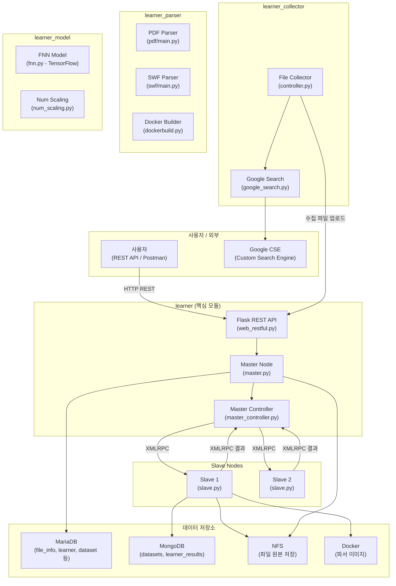
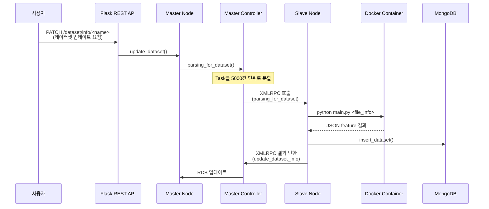
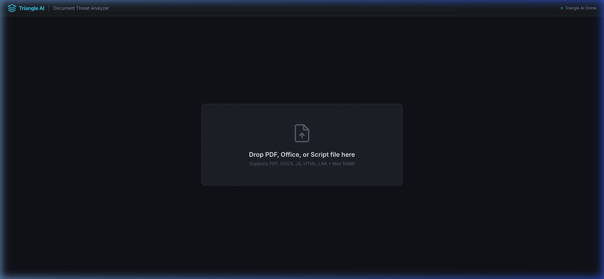
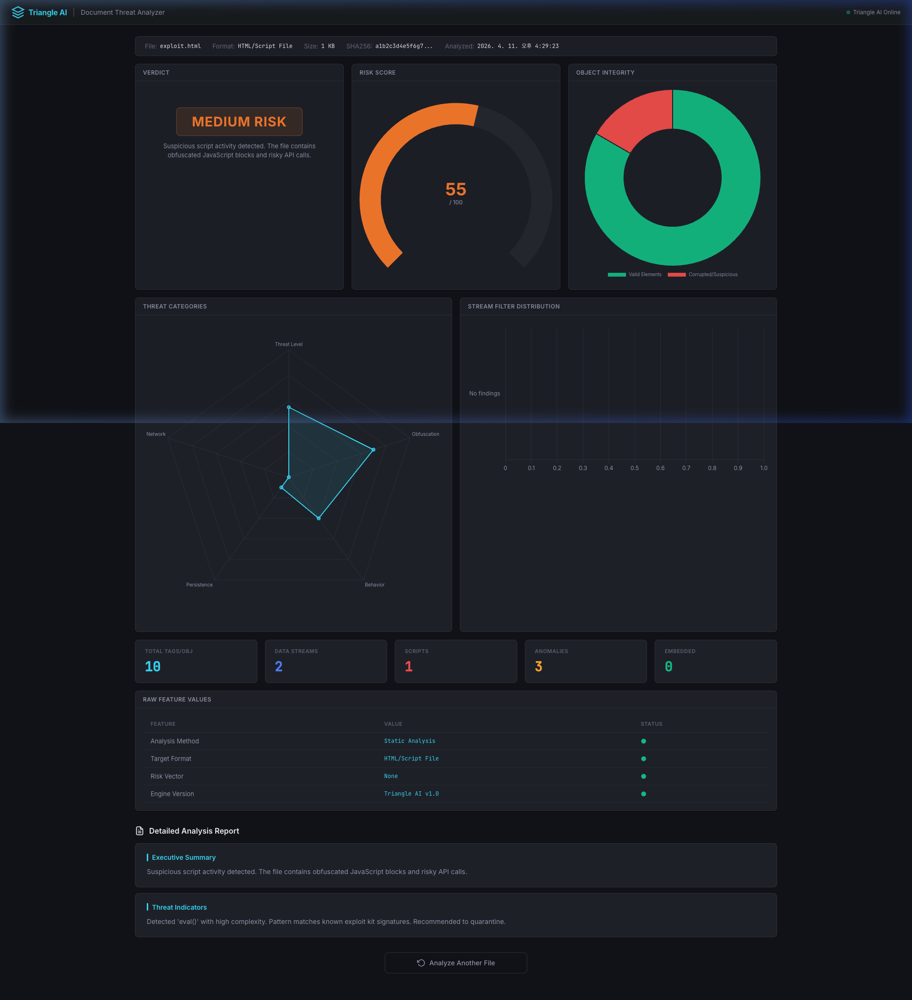
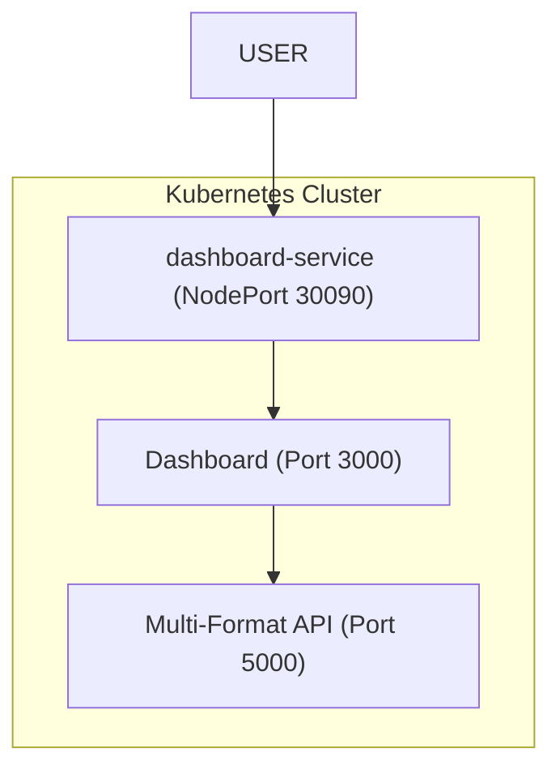
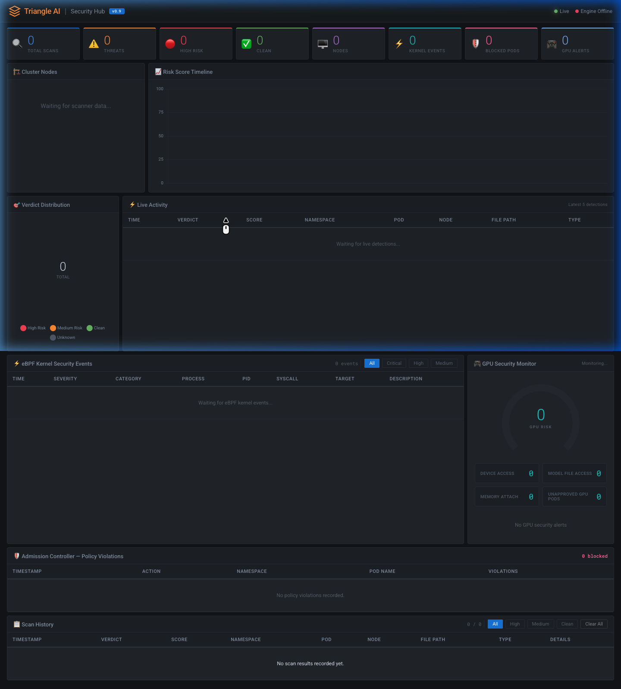
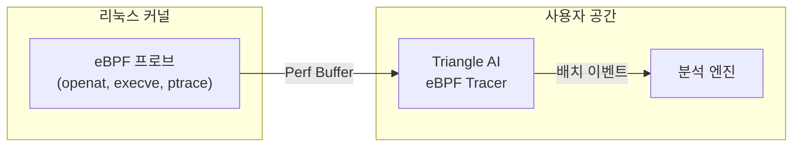
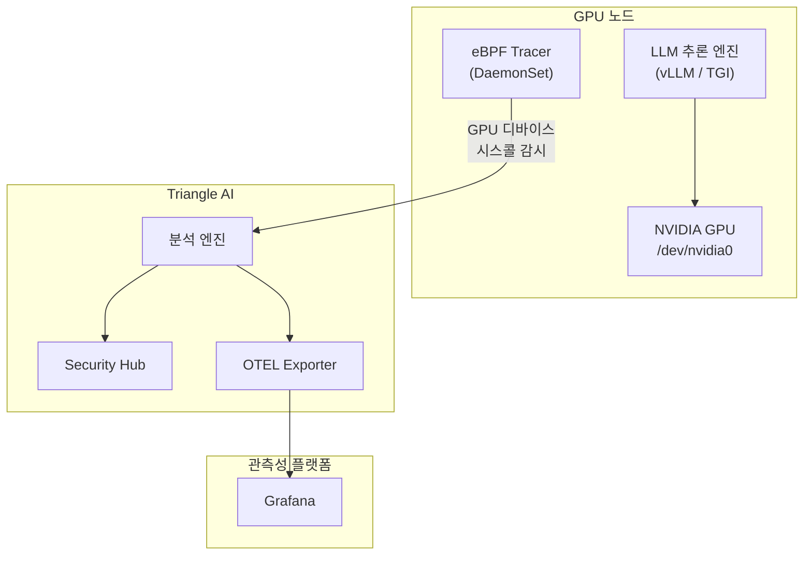

# Triangle AI

## 📌 개요

**Triangle AI**는 **파일 기반 악성코드 탐지를 위한 분산 머신러닝 프레임워크**입니다.

주로 **PDF, MS Office, JavaScript, HTML, LNK, SWF** 등의 다양한 파일 포맷을 분석하여 구조적 특징(feature)을 추출하고, 이를 기반으로 **정적 분석 및 머신러닝**을 사용하여 **양성(benign) / 악성(malicious)** 파일을 분류합니다.

### 📁 분석 지원 파일 및 탐지 범위

| 파일 타입 | 확장자 | 탐지/분석 주요 내용 |
|:---|:---|:---|
| **PDF** | `.pdf` | JavaScript 엔진, 임베디드 PE, 스트림 난독화, 구조적 손상 분석 |
| **MS Office** | `.docx, .docm, .xlsx, .xlsm` | VBA 매크로 위협 탐지 (MacroRaptor), 외부 연결 및 난독화 분석 |
| **Scripts** | `.js, .vbs, .ps1` | `eval`, `unescape`, `PowerShell/CMD` 실행 패턴 및 난독화 탐지 |
| **Web** | `.html, .htm` | 유해 스크립트 태그, ActiveX 객체, 피싱/XSS 패턴 분석 |
| **Windows Link** | `.lnk` | 파워쉘/명령프롬프트를 이용한 2차 페이로드 다운로드 및 실행 탐지 |
| **Flash** | `.swf` | ActionScript API 호출 패턴 및 YARA 규칙 기반 위협 분석 |

> [!IMPORTANT]
> 이 시스템은 단일 서버가 아닌 **Master-Slave 클러스터** 아키텍처로 설계되어 있습니다. XMLRPC 기반의 분산 처리를 통해 대량의 파일을 병렬로 파싱하고 학습합니다.

---

## 🏗️ 시스템 아키텍처



---

## 📦 4개 핵심 모듈 상세 분석

### 1. `learner` — 핵심 프레임워크 (Master/Slave 클러스터)

전체 시스템의 **중추 역할**을 하는 모듈입니다.

| 파일 | 역할 |
|------|------|
| `starter.py` | 클러스터 엔트리포인트. Master/Slave를 multiprocessing으로 기동 |
| `cluster/master.py` | **Master 노드 인터페이스** — 파일 업로드, 데이터셋 관리, 알고리즘 관리, 학습 명령, 예측 |
| `cluster/master_controller.py` | **클러스터 제어** — Task 생성, Slave 연결/할당, XMLRPC 서버/클라이언트 |
| `cluster/slave.py` | **Slave 노드** — Docker 컨테이너 내에서 파일 파싱, TF 학습/예측 수행 |
| `ui/web_restful.py` | Flask-RESTful 기반 **HTTP API** (포트 8000) |
| `db/rdb.py` | MariaDB 클라이언트 (파티셔닝, 트랜잭션 최적화) |
| `db/nosql.py` | MongoDB 클라이언트 (데이터셋 저장/조회) |
| `db/nfs.py` | NFS 파일 시스템 클라이언트 (SHA256 기반 경로 분산) |
| `db/rdb_schemas.py` | 12개 테이블 스키마 정의 |
| `util/essential.py` | 유틸리티 (해시 계산, 설정 파일 로딩, DB 커서→딕셔너리 변환) |

#### Master-Slave 통신 구조



---

### 2. `learner_collector` — 파일 수집기

**Google Custom Search Engine API**를 사용하여 인터넷에서 파일(주로 PDF)을 자동 수집합니다.

| 파일 | 역할 |
|------|------|
| `collector/controller.py` | 수집 프로세스 관리 — 주기적 스케줄링, 자식 프로세스 모니터링 |
| `collector/google_search.py` | Google CSE API 래퍼 — 키워드 검색, MIME 필터링, 자동 페이징 |

**동작 흐름:**
1. Google CSE로 특정 파일 타입(pdf 등) 검색
2. MIME type 검증 후 파일 다운로드
3. MD5/SHA1/SHA256 해시 계산
4. NFS에 파일 저장 + Master REST API로 메타정보 전송

---

### 3. `learner_model` — ML 모델

**TensorFlow 기반 Feedforward Neural Network (FNN)** 구현체입니다.

| 파일 | 역할 |
|------|------|
| `model/fnn.py` | **다층 FNN** — 가변 Hidden Layer, Adagrad 옵티마이저, Softmax 출력 |
| `scaling/num_scaling.py` | Feature 정규화 — log(1+x) 스케일링 |

**FNN 모델 특징:**
- 입력: 파일 feature 벡터 → 가변 Hidden Layer(기본 3×100) → Softmax 출력(benign/malicious)
- `partial_fit()`: 온라인 배치 학습
- `export_learner()` / `load_learner()`: tar.gz 형태로 모델 직렬화/역직렬화
- 알고리즘 스크립트를 **DB에 저장**하여 런타임에 `compile()` + `exec()`으로 동적 로딩

---

### 4. `learner_parser` — 파일 파서 (Feature Extractor)

파일 포맷을 심층 분석하여 **머신러닝 학습용 feature를 추출**합니다.

| 파일 | 역할 |
|------|------|
| `parser/pdf/main.py` | **PDF 파서** — 정례식 기반 파싱, 스트림 디코딩, JS 추출, 임베디드 파일 탐지 |
| `parser/swf/main.py` | **SWF(Flash) 파서** — 태그 분석, ActionScript 추출, YARA 규칙 기반 API 탐지 |

---

## 🔌 REST API 엔드포인트

포트 **8000**에서 Flask-RESTful 서버가 동작합니다.

| 경로 | Method | 기능 |
|------|--------|------|
| `/files` | POST | 파일 업로드 (NFS 저장 + RDB 메타정보) |
| `/dataset/info` | PATCH | **데이터셋 파싱 시작** (분산 처리) |
| `/classification/learners/<name>` | PATCH | **학습 시작** |
| `/classification/learners/<name>/predict` | POST | **파일 예측** (benign/malicious) |

---

## 🐳 Kubernetes 배포 가이드

Triangle AI의 분석 엔진을 Kubernetes에 배포하고 결과 시각화 대시보드를 제공합니다.

#### 메인 대시보드 (파일 업로드)


#### 상세 분석 결과 리포트


### 배포 아키텍처



### 배포 명령어

```bash
cd k8s-deploy
bash deploy.sh
```

---

## 🤖 AI 기반 고도화 분석 (Ollama 연동)

Triangle AI v0.1은 **Ollama를 통한 로컬 LLM** 연동을 지원하여, 정적 분석 결과를 바탕으로 사람이 읽기 쉬운 전문적인 기술 리포트와 대응 방안을 생성합니다.

### 📋 사전 요구사항
1.  호스트 머신에 **Ollama**가 설치되어 있어야 합니다 ([ollama.com](https://ollama.com)).
2.  분석에 사용할 모델을 다운로드(pull)합니다:
    - `gemma4:e2b` (고성능 보안 분석 추천)
    - `mistral:7b`
    - `qwen2.5:7b` (스크립트 및 코드 분석 특화)

### ⚙️ 설정 방법
분석 엔진 컨테이너는 `host.minikube.internal` 주소를 통해 호스트의 Ollama와 통신합니다 (Minikube 기본값).

모델이나 URL을 변경하려면 `k8s/pdf-analyzer.yaml`의 환경 변수를 수정하세요:
```yaml
env:
  - name: OLLAMA_URL
    value: "http://host.minikube.internal:11434"
  - name: OLLAMA_MODEL
    value: "gemma4:e2b"
```

### 🧠 분석 리포트 포함 내용
- **위협 평가 (Threat Assessment)**: 파일의 잠재적 의도에 대한 고수준 요약.
- **기술적 영향 (Technical Impact)**: 탐지된 지표(매크로, JS API 등)가 시스템에 미칠 수 있는 영향 분석.
- **대응 권고 (Actionable Mitigation)**: 발견된 위협에 대한 전문가 수준의 조치 가이드.

---

## 🚀 Cloud Native Security Hub (실시간 보안 관제)

Triangle AI는 이제 Kubernetes 클러스터의 실시간 보안 모니터링을 위한 **Cloud Native Security Hub**를 포함합니다. DaemonSet 기반의 스캐너가 실시간으로 노드 파일 시스템의 변화를 감지하고, Kubernetes API를 통해 해당 이벤트가 어떤 **네임스페이스**와 **파드**에서 발생했는지 추적합니다.



### 주요 기능
- **실시간 노드 보호**: DaemonSet 스캐너가 클러스터 내로 유입되는 모든 파일(볼륨 마운트, hostPath 등)을 실시간 감시합니다.
- **K8s Context Aware**: 파일 이벤트 발생 시 관련 **네임스페이스**와 **파드** 이름을 자동으로 식별합니다.
- **SOC Intelligence**: Grafana 스타일의 고성능 대시보드, 실시간 위협 피드, 위험 점수 시계열 차트 및 분포도를 제공합니다.
- **지속적 포렌식**: 브라우저 기반의 로컬 저장소를 활용하여, 페이지 새로고침 시에도 소실되지 않는 분석 이력(검색/정렬 가능)을 제공합니다.
- **AI 분석 자동화**: Ollama를 활용하여 탐지된 위협에 대한 AI 요약 및 대응 전략을 실시간으로 생성합니다.

### 설치 및 사용법
1. **모든 구성 요소 배포**:
   ```bash
   kubectl apply -f k8s-deploy/k8s/
   ```
2. **Security Hub 접속**:
   ```bash
   kubectl port-forward service/security-hub-service -n npe-learner 30091:3001
   ```
   브라우저에서 `http://localhost:30091` 주소로 접속합니다.

---

## ⚡ eBPF 기반 커널 보안 추적

Triangle AI v0.2는 **eBPF (extended Berkeley Packet Filter)** 기반의 고성능 커널 추적기를 도입하여, 애플리케이션 코드 수정이나 사이드카 프록시 없이 리눅스 커널 레벨에서 시스콜(syscall)을 실시간으로 모니터링합니다.

### 동작 원리



### 추적 대상 시스콜
| 시스콜 | 탐지 대상 |
|--------|----------|
| `openat` | 민감 파일 접근 (시크릿, shadow, GPU 디바이스) |
| `execve` | 의심스러운 프로세스 실행 (쉘, curl, wget) |
| `ptrace` | 프로세스 인젝션, GPU 메모리 탈취 시도 |

### 배포 방법
```bash
kubectl apply -f k8s-deploy/k8s/ebpf-tracer-daemonset.yaml
```

> [!NOTE]
> eBPF 추적기는 `privileged: true`와 커널 헤더가 필요합니다. DaemonSet으로 배포되어 클러스터의 모든 노드를 커버합니다.

---

## 🛡️ Admission Controller (보안 정책 웹훅)

Triangle AI에는 보안 요구사항을 충족하지 않는 컨테이너의 **생성 자체를 차단**하는 **Kubernetes ValidatingWebhookConfiguration**이 포함되어 있습니다. 보안을 탐지(detection)에서 예방(prevention)으로 전환합니다.

### 적용 보안 정책

| 정책 | 설명 | 기본값 |
|------|------|--------|
| **Privileged 모드** | `privileged: true`를 요청하는 컨테이너 차단 | ✅ 활성 |
| **Root 사용자** | UID 0으로 실행되는 컨테이너 차단 | ✅ 활성 |
| **리소스 제한** | 모든 컨테이너에 CPU/메모리 Limits 요구 | ✅ 활성 |
| **Host Path** | `hostPath` 볼륨 마운트 차단 | ✅ 활성 |
| **Host Namespace** | `hostPID`, `hostNetwork` 접근 차단 | ✅ 활성 |
| **이미지 레지스트리** | 허가된 레지스트리의 이미지만 허용 | ✅ 활성 |
| **위험 Capability** | `SYS_ADMIN`, `NET_RAW`, `SYS_PTRACE`, `ALL` 차단 | ✅ 활성 |
| **GPU 어노테이션** | GPU 사용 시 `triangle-ai/gpu-approved: true` 어노테이션 요구 | ✅ 활성 |

### 배포 방법
```bash
# 1. TLS 인증서 생성
openssl req -x509 -newkey rsa:2048 -keyout tls.key -out tls.crt \
  -days 365 -nodes -subj "/CN=triangle-admission-controller.npe-learner.svc"

# 2. K8s TLS 시크릿 생성
kubectl create secret tls triangle-admission-tls \
  --cert=tls.crt --key=tls.key -n npe-learner

# 3. 웹훅 배포
kubectl apply -f k8s-deploy/k8s/admission-controller.yaml
```

> [!IMPORTANT]
> 차단된 파드 생성 시도는 Triangle AI 감사 로그에 자동 기록되며, `/api/admission-events` 엔드포인트에서 조회할 수 있습니다.

---

## 📡 OpenTelemetry 연동 (OTLP 내보내기)

Triangle AI의 모든 보안 이벤트를 **OpenTelemetry Protocol (OTLP)** 포맷으로 내보내어 다양한 관측성(Observability) 플랫폼과 원활하게 연동할 수 있습니다.

### 지원 백엔드
- **Grafana** (Tempo로 트레이스, Mimir로 메트릭, Loki로 로그)
- **Jaeger** (분산 트레이싱)
- **Datadog**, **New Relic**, **Splunk** (OTLP 엔드포인트 경유)

### 내보내기 신호

| 신호 | 내용 | 포맷 |
|------|------|------|
| **Traces** | 각 보안 스캔을 파일/K8s 속성이 포함된 스팬(Span)으로 | OTLP gRPC/HTTP |
| **Metrics** | `triangle.security.scans.total`, `triangle.security.threats.total`, `triangle.security.risk_score` | OTLP gRPC/HTTP |
| **Logs** | 심각도 매핑이 포함된 구조화된 보안 이벤트 로그 | OTLP gRPC/HTTP |

### 배포 방법
```bash
kubectl apply -f k8s-deploy/k8s/otel-exporter.yaml
```

### 환경 변수 설정
| 변수 | 기본값 | 설명 |
|------|--------|------|
| `OTEL_EXPORTER_OTLP_ENDPOINT` | `http://otel-collector:4317` | OTLP 수집기 엔드포인트 |
| `OTEL_EXPORTER_OTLP_PROTOCOL` | `grpc` | 프로토콜 (`grpc` 또는 `http/protobuf`) |
| `OTEL_SERVICE_NAME` | `triangle-ai-security` | 트레이스에 표시되는 서비스 이름 |

---

## 🎮 GPU 보안 모니터링

Triangle AI v0.2는 보안 모니터링을 **GPU 가속 LLM 추론 워크로드**까지 확장하여, 비인가 GPU 메모리 접근과 모델 가중치 탈취 시도를 탐지합니다.

### 위협 탐지 범위

| 위협 | 탐지 방법 | 심각도 |
|------|----------|--------|
| **GPU 디바이스 직접 접근** | `/dev/nvidia*`, `/proc/driver/nvidia` 열기에 대한 eBPF 추적 | 🔴 높음 |
| **모델 가중치 탈취** | `.safetensors`, `.pt`, `.gguf`, `.onnx`, `.bin` 파일 접근 감시 | 🔴 높음 |
| **GPU 메모리 Attach** | GPU 사용 프로세스에 대한 `ptrace(PTRACE_ATTACH)` 감지 | 🔴 치명적 |
| **GPU 메모리 Peek** | GPU 프로세스 메모리 읽기 `ptrace(PTRACE_PEEKDATA)` 감지 | 🔴 치명적 |
| **비인가 GPU 할당** | `nvidia.com/gpu` 요청 시 어노테이션 없으면 Admission Controller가 차단 | 🟡 중간 |

### 아키텍처



### 활성화 방법
eBPF 추적기 DaemonSet에서 `GPU_MONITOR_ENABLED` 환경 변수를 `true`로 설정합니다:
```yaml
env:
  - name: GPU_MONITOR_ENABLED
    value: "true"
```

> [!WARNING]
> GPU 모니터링은 eBPF 추적기가 GPU 노드에서 실행되어야 합니다. DaemonSet이 GPU 노드의 taint를 tolerate하도록 설정되어 있는지 확인하세요.

---

