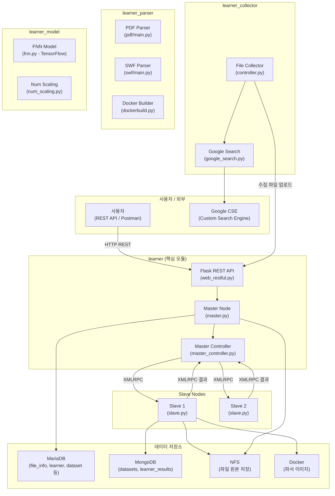
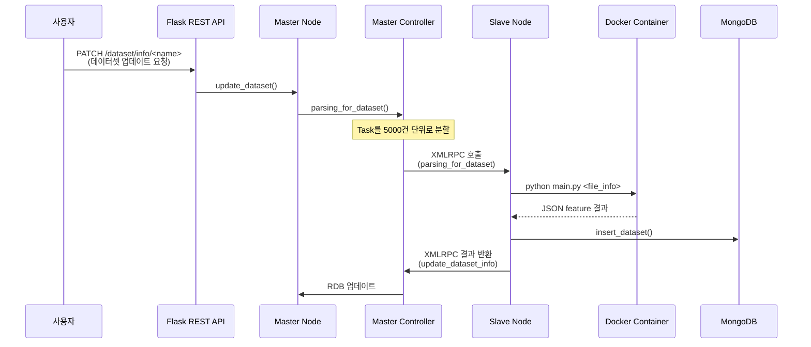
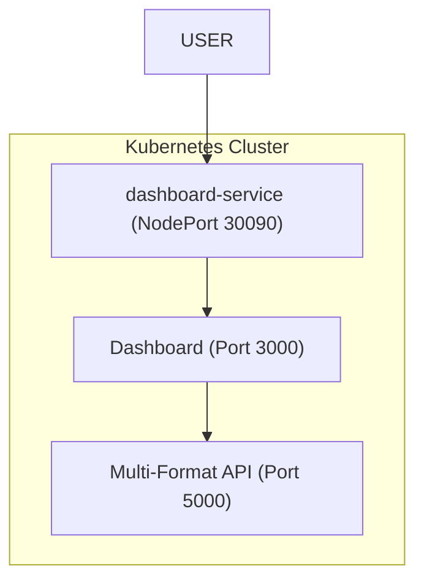

# Triangle AI

## 📌 개요

**Triangle AI**는 **파일 기반 악성코드 탐지를 위한 분산 머신러닝 프레임워크**입니다.

주로 **PDF, MS Office, JavaScript, HTML, LNK, SWF** 등의 다양한 파일 포맷을 분석하여 구조적 특징(feature)을 추출하고, 이를 기반으로 **정적 분석 및 머신러닝**을 사용하여 **양성(benign) / 악성(malicious)** 파일을 분류합니다.

### 📁 분석 지원 파일 및 탐지 범위

| 파일 타입 | 확장자 | 탐지/분석 주요 내용 |
|:---|:---|:---|
| **PDF** | `.pdf` | JavaScript 엔진, 임베디드 PE, 스트림 난독화, 구조적 손상 분석 |
| **MS Office** | `.docx, .docm, .xlsx, .xlsm` | VBA 매크로 위협 탐지 (MacroRaptor), 외부 연결 및 난독화 분석 |
| **Scripts** | `.js, .vbs, .ps1` | `eval`, `unescape`, `PowerShell/CMD` 실행 패턴 및 난독화 탐지 |
| **Web** | `.html, .htm` | 유해 스크립트 태그, ActiveX 객체, 피싱/XSS 패턴 분석 |
| **Windows Link** | `.lnk` | 파워쉘/명령프롬프트를 이용한 2차 페이로드 다운로드 및 실행 탐지 |
| **Flash** | `.swf` | ActionScript API 호출 패턴 및 YARA 규칙 기반 위협 분석 |

> [!IMPORTANT]
> 이 시스템은 단일 서버가 아닌 **Master-Slave 클러스터** 아키텍처로 설계되어 있습니다. XMLRPC 기반의 분산 처리를 통해 대량의 파일을 병렬로 파싱하고 학습합니다.

---

## 🏗️ 시스템 아키텍처



---

## 📦 4개 핵심 모듈 상세 분석

### 1. `learner` — 핵심 프레임워크 (Master/Slave 클러스터)

전체 시스템의 **중추 역할**을 하는 모듈입니다.

| 파일 | 역할 |
|------|------|
| `starter.py` | 클러스터 엔트리포인트. Master/Slave를 multiprocessing으로 기동 |
| `cluster/master.py` | **Master 노드 인터페이스** — 파일 업로드, 데이터셋 관리, 알고리즘 관리, 학습 명령, 예측 |
| `cluster/master_controller.py` | **클러스터 제어** — Task 생성, Slave 연결/할당, XMLRPC 서버/클라이언트 |
| `cluster/slave.py` | **Slave 노드** — Docker 컨테이너 내에서 파일 파싱, TF 학습/예측 수행 |
| `ui/web_restful.py` | Flask-RESTful 기반 **HTTP API** (포트 8000) |
| `db/rdb.py` | MariaDB 클라이언트 (파티셔닝, 트랜잭션 최적화) |
| `db/nosql.py` | MongoDB 클라이언트 (데이터셋 저장/조회) |
| `db/nfs.py` | NFS 파일 시스템 클라이언트 (SHA256 기반 경로 분산) |
| `db/rdb_schemas.py` | 12개 테이블 스키마 정의 |
| `util/essential.py` | 유틸리티 (해시 계산, 설정 파일 로딩, DB 커서→딕셔너리 변환) |

#### Master-Slave 통신 구조



---

### 2. `learner_collector` — 파일 수집기

**Google Custom Search Engine API**를 사용하여 인터넷에서 파일(주로 PDF)을 자동 수집합니다.

| 파일 | 역할 |
|------|------|
| `collector/controller.py` | 수집 프로세스 관리 — 주기적 스케줄링, 자식 프로세스 모니터링 |
| `collector/google_search.py` | Google CSE API 래퍼 — 키워드 검색, MIME 필터링, 자동 페이징 |

**동작 흐름:**
1. Google CSE로 특정 파일 타입(pdf 등) 검색
2. MIME type 검증 후 파일 다운로드
3. MD5/SHA1/SHA256 해시 계산
4. NFS에 파일 저장 + Master REST API로 메타정보 전송

---

### 3. `learner_model` — ML 모델

**TensorFlow 기반 Feedforward Neural Network (FNN)** 구현체입니다.

| 파일 | 역할 |
|------|------|
| `model/fnn.py` | **다층 FNN** — 가변 Hidden Layer, Adagrad 옵티마이저, Softmax 출력 |
| `scaling/num_scaling.py` | Feature 정규화 — log(1+x) 스케일링 |

**FNN 모델 특징:**
- 입력: 파일 feature 벡터 → 가변 Hidden Layer(기본 3×100) → Softmax 출력(benign/malicious)
- `partial_fit()`: 온라인 배치 학습
- `export_learner()` / `load_learner()`: tar.gz 형태로 모델 직렬화/역직렬화
- 알고리즘 스크립트를 **DB에 저장**하여 런타임에 `compile()` + `exec()`으로 동적 로딩

---

### 4. `learner_parser` — 파일 파서 (Feature Extractor)

파일 포맷을 심층 분석하여 **머신러닝 학습용 feature를 추출**합니다.

| 파일 | 역할 |
|------|------|
| `parser/pdf/main.py` | **PDF 파서** — 정례식 기반 파싱, 스트림 디코딩, JS 추출, 임베디드 파일 탐지 |
| `parser/swf/main.py` | **SWF(Flash) 파서** — 태그 분석, ActionScript 추출, YARA 규칙 기반 API 탐지 |

---

## 🔌 REST API 엔드포인트

포트 **8000**에서 Flask-RESTful 서버가 동작합니다.

| 경로 | Method | 기능 |
|------|--------|------|
| `/files` | POST | 파일 업로드 (NFS 저장 + RDB 메타정보) |
| `/dataset/info` | PATCH | **데이터셋 파싱 시작** (분산 처리) |
| `/classification/learners/<name>` | PATCH | **학습 시작** |
| `/classification/learners/<name>/predict` | POST | **파일 예측** (benign/malicious) |

---

## 🐳 Kubernetes 배포 가이드

Triangle AI의 분석 엔진을 Kubernetes에 배포하고 결과 시각화 대시보드를 제공합니다.

### 배포 아키텍처



### 배포 명령어

```bash
cd k8s-deploy
bash deploy.sh
```

---

## 🤖 AI 기반 고도화 분석 (Ollama 연동)

Triangle AI v0.1은 **Ollama를 통한 로컬 LLM** 연동을 지원하여, 정적 분석 결과를 바탕으로 사람이 읽기 쉬운 전문적인 기술 리포트와 대응 방안을 생성합니다.

### 📋 사전 요구사항
1.  호스트 머신에 **Ollama**가 설치되어 있어야 합니다 ([ollama.com](https://ollama.com)).
2.  분석에 사용할 모델을 다운로드(pull)합니다:
    - `llama3.1:8b` (일반적인 보안 분석 추천)
    - `mistral:7b`
    - `qwen2.5-coder:7b` (스크립트 및 코드 분석 특화)

### ⚙️ 설정 방법
분석 엔진 컨테이너는 `host.docker.internal` 주소를 통해 호스트의 Ollama와 통신합니다 (Docker Desktop 기본값).

모델이나 URL을 변경하려면 `k8s/pdf-analyzer.yaml`의 환경 변수를 수정하세요:
```yaml
env:
  - name: OLLAMA_URL
    value: "http://host.docker.internal:11434"
  - name: OLLAMA_MODEL
    value: "llama3.1:8b"
```

### 🧠 분석 리포트 포함 내용
- **위협 평가 (Threat Assessment)**: 파일의 잠재적 의도에 대한 고수준 요약.
- **기술적 영향 (Technical Impact)**: 탐지된 지표(매크로, JS API 등)가 시스템에 미칠 수 있는 영향 분석.
- **대응 권고 (Actionable Mitigation)**: 발견된 위협에 대한 전문가 수준의 조치 가이드.
